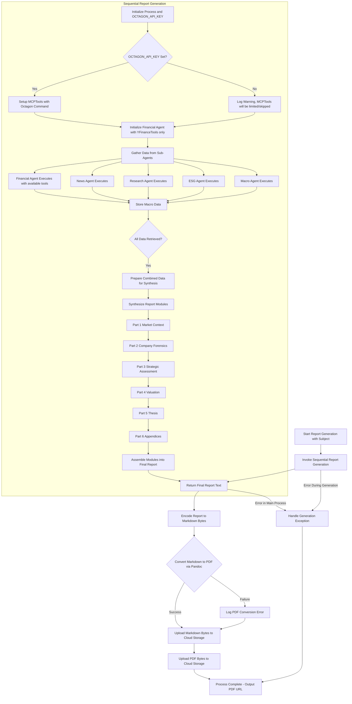

# Agno Finance Report Agent

This agent generates comprehensive financial research reports for a specified subject (e.g., a publicly traded company). It utilizes a multi-agent architecture where specialized sub-agents gather diverse data, and synthesis agents compile this data into a detailed, structured report. The final output includes both Markdown and PDF versions of the report, which are then uploaded to a cloud storage solution (DigitalOcean Spaces).

## Agent Workflow Overview

The following diagram illustrates the high-level workflow of the `agent_definition.py` script:

## Key Steps Explained

1.  **Initiation**: The process begins with a `query_subject` (e.g., "NVIDIA (NVDA)"). The `OCTAGON_API_KEY` is loaded from environment variables.
2.  **MCPTools Setup (for Financial Data Agent)**:
    *   If the `OCTAGON_API_KEY` is available, `MCPTools` from `agno.tools.mcp` is initialized. This setup configures `MCPTools` to run the `octagon-mcp` server command (e.g., `env OCTAGON_API_KEY='...' npx -y octagon-mcp@latest`), enabling access to Octagon's specialized financial data agents.
    *   The `financial_data_agent` is then initialized with both this `MCPTools` instance and `YFinanceTools`.
    *   If `OCTAGON_API_KEY` is not set, a warning is logged, and the `financial_data_agent` is initialized primarily with `YFinanceTools`, and Octagon tools will be unavailable.
3.  **Data Gathering**:
    *   Five specialized agents (`financial_data_agent`, `news_agent`, `research_agent`, `esg_agent`, `macro_agent`) are invoked to collect specific types of information.
    *   The `financial_data_agent` is instructed to prioritize Octagon tools (via the MCP interface like `octagon-financials-agent`, `octagon-sec-agent`) for detailed financial statements, SEC filings, and earnings transcripts, falling back to `YFinanceTools` for other data or if Octagon data is insufficient.
    *   Other agents use tools like Yahoo Finance, Google Search, and Exa AI.
    *   Rate limiting is applied to respect API usage policies.
4.  **Data Synthesis Input Preparation**: Once all sub-agents complete their tasks, their outputs are combined into a single large JSON block. This block serves as the input for the synthesis phase.
5.  **Modular Report Synthesis**:
    *   The report is constructed in six distinct parts by specialized synthesis agents. Each synthesis agent receives the full data block but is instructed to focus on generating its assigned part (e.g., Market Context, Company Forensics, etc.).
    *   This modular approach allows for detailed and focused content generation for each section of the report.
    *   The agents are designed to produce extensive, data-rich text formatted in Markdown, with specific instructions for LaTeX compatibility for PDF conversion.
6.  **Report Finalization**:
    *   The generated Markdown parts are assembled into a single comprehensive report string.
    *   This Markdown content is encoded to bytes.
7.  **PDF Conversion**:
    *   The `_convert_md_to_pdf` function uses `pandoc` (with a LaTeX engine like `xelatex`) to convert the Markdown content string (via temporary files) into PDF bytes.
8.  **Cloud Storage Upload**:
    *   The `_upload_to_do_spaces` function uploads both the final Markdown content (as bytes) and the generated PDF bytes to a configured DigitalOcean Spaces bucket.
    *   The files are made publicly accessible, and the PDF URL is the primary output if successful.
9.  **Error Handling**: The script includes error handling for various stages, including data retrieval, report synthesis, PDF conversion, and file uploads.

## Core Dependencies for Key Operations

*   **Pandoc & LaTeX**: Essential for converting the Markdown report to PDF. A LaTeX distribution (like TeX Live with `xelatex`) needs to be installed for Pandoc's PDF engine.
*   **Boto3**: Used for interacting with DigitalOcean Spaces for file uploads.
*   **OpenAI API**: Powers the language models for all data gathering and synthesis agents.
*   **Agno SDK**: Provides the core `Agent` class, `MCPTools` for Octagon integration, and other tool wrappers (YFinance, GoogleSearch, Exa, Firecrawl).
*   **Octagon MCP**:
    *   Requires `OCTAGON_API_KEY` to be set in the environment.
    *   The `octagon-mcp` command-line tool (typically run via `npx octagon-mcp@latest`) must be executable in the environment where `agent_definition.py` runs. This is invoked by `MCPTools`.
*   **Various Data Source APIs**: Yahoo Finance (yfinance), Firecrawl, Exa, Google Search, and Octagon Market Intelligence API (via MCP).

This workflow ensures a robust and detailed report generation process, from raw data collection to final document distribution.
