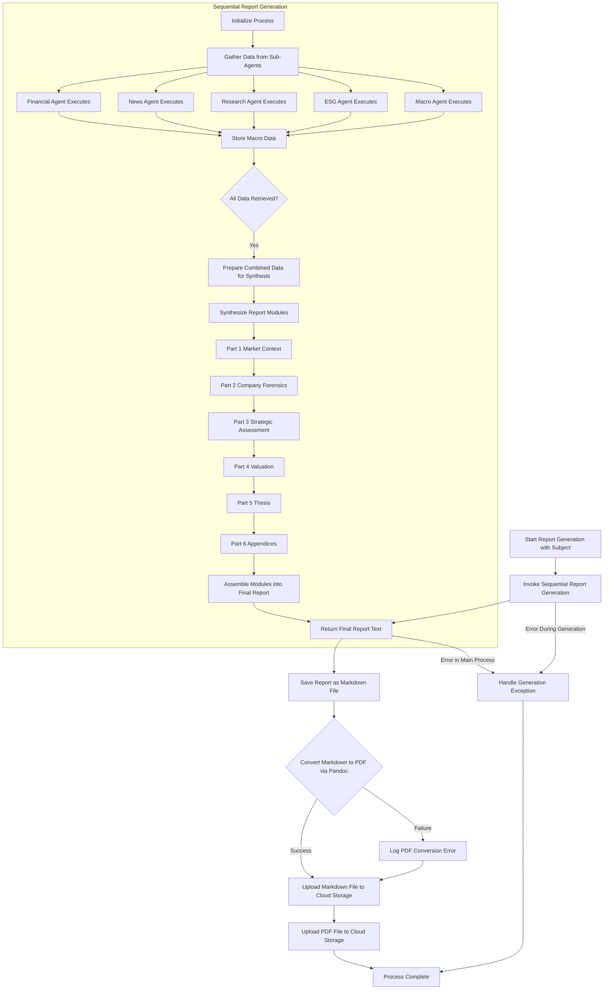

# Agno Finance Report Agent

This agent generates comprehensive financial research reports for a specified subject (e.g., a publicly traded company). It utilizes a multi-agent architecture where specialized sub-agents gather diverse data, and synthesis agents compile this data into a detailed, structured report. The final output includes both Markdown and PDF versions of the report, which are then uploaded to a cloud storage solution (DigitalOcean Spaces).

## Agent Workflow Overview

The following diagram illustrates the high-level workflow of the `agent_definition.py` script:

## Key Steps Explained

1.  **Initiation**: The process begins with a `query_subject` (e.g., "NVIDIA (NVDA)").
2.  **Data Gathering**:
    *   Five specialized agents (`financial_data_agent`, `news_agent`, `research_agent`, `esg_agent`, `macro_agent`) are invoked concurrently to collect specific types of information.
    *   Each agent uses tools like Yahoo Finance, Google Search, and Exa AI to find relevant data.
    *   Rate limiting is applied to respect API usage policies.
3.  **Data Synthesis Input Preparation**: Once all sub-agents complete their tasks, their outputs are combined into a single large JSON block. This block serves as the input for the synthesis phase.
4.  **Modular Report Synthesis**:
    *   The report is constructed in six distinct parts by specialized synthesis agents. Each synthesis agent receives the full data block but is instructed to focus on generating its assigned part (e.g., Market Context, Company Forensics, etc.).
    *   This modular approach allows for detailed and focused content generation for each section of the report.
    *   The agents are designed to produce extensive, data-rich text formatted in Markdown, with specific instructions for LaTeX compatibility for PDF conversion.
5.  **Report Finalization**:
    *   The generated Markdown parts are assembled into a single comprehensive report.
    *   This Markdown report is saved to a local file.
6.  **PDF Conversion**:
    *   The `_convert_md_to_pdf` function uses `pandoc` (with a LaTeX engine like `pdflatex`) to convert the Markdown file into a PDF document.
7.  **Cloud Storage Upload**:
    *   The `_upload_to_do_spaces` function uploads both the final Markdown (`.md`) file and the generated PDF (`.pdf`) file to a configured DigitalOcean Spaces bucket.
    *   The files are made publicly accessible.
8.  **Error Handling**: The script includes error handling for various stages, including data retrieval, report synthesis, PDF conversion, and file uploads.

## Core Dependencies for Key Operations

*   **Pandoc & LaTeX**: Essential for converting the Markdown report to PDF. A LaTeX distribution (like TeX Live) needs to be installed for Pandoc's PDF engine.
*   **Boto3**: Used for interacting with DigitalOcean Spaces for file uploads.
*   **OpenAI API**: Powers the language models for all data gathering and synthesis agents.
*   **Various Data Source APIs**: Yahoo Finance (yfinance), Firecrawl, Exa, Google Search.

This workflow ensures a robust and detailed report generation process, from raw data collection to final document distribution.
