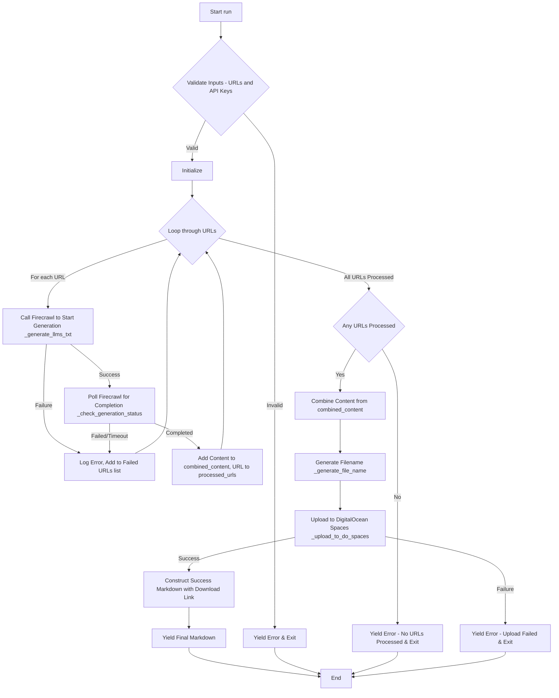

# Agno LLM Text Agent

An AI agent that generates an llms.txt file to help language models understand and use your website content effectively.

## Features

- Text generation via Large Language Models
- Masumi payment integration for monetizing AI services
- FastAPI-based REST API
- Payment status monitoring and management
- MIP-003 compliant API endpoints

## Setup

### Prerequisites

- Python 3.10 or higher
- Cardano wallet (for receiving payments)
- Masumi API credentials

### Installation

1. Create a virtual environment:
   ```bash
   python -m venv venv
   source venv/bin/activate  # On Windows: venv\Scripts\activate
   ```

2. Install dependencies:
   ```bash
   pip install -r requirements.txt
   ```

3. Create a `.env` file with the following variables:
   ```
   # OpenAI API Key
   OPENAI_API_KEY=your_openai_api_key

   # Masumi Payment Service
   PAYMENT_SERVICE_URL=https://payment.masumi.network/api/v1
   PAYMENT_API_KEY=your_masumi_payment_api_key
   NETWORK=PREPROD  # Or MAINNET for production

   # Agent Configuration
   AGENT_IDENTIFIER=your_agent_identifier_from_masumi
   PAYMENT_AMOUNT=10000000  # Amount in lovelace (10 ADA)
   PAYMENT_UNIT=lovelace
   SELLER_VKEY=your_cardano_verification_key
   ```

## Usage

### Starting the API Server

Run the API server:
```bash
python main.py api
```

The server will be available at http://localhost:8000.

### API Documentation

Once running, visit http://localhost:8000/docs for interactive Swagger documentation.

### API Endpoints

- `POST /start_job`: Submit a text generation job
- `GET /status`: Check job status
- `GET /availability`: Check server availability
- `GET /input_schema`: Get input schema for job requests
- `GET /health`: Health check endpoint

## Agent Workflow Overview

The core logic of the `agent_definition.py` is encapsulated in the `LLMsTxtGeneratorWorkflow`. Here's a flowchart outlining its `run` method, which is the primary process for generating `llms.txt` files:



## Troubleshooting

### Common Issues

1. **"network: Required" error**:
   - Ensure NETWORK is set to "PREPROD" (all caps) in your .env file
   - Verify the PAYMENT_SERVICE_URL includes "/api/v1"
   - Confirm your Masumi API key is correctly set

2. **F-string Syntax Error**:
   - If you see errors about f-strings with nested quotes, ensure you're using Python 3.10+
   - Use single quotes inside f-strings with double quotes

3. **Payment Connection Issues**:
   - Check network connectivity to payment.masumi.network
   - Verify your AGENT_IDENTIFIER is correctly registered with Masumi

## Directory Structure

- `agent_definition.py`: Defines the LLM agent capabilities
- `main.py`: FastAPI server and payment integration
- `logging_config.py`: Logging setup
- `tools/`: Custom tools for the agent
- `logs/`: Log files directory
- `db/`: Database storage (if used)

## License

Proprietary - All rights reserved
