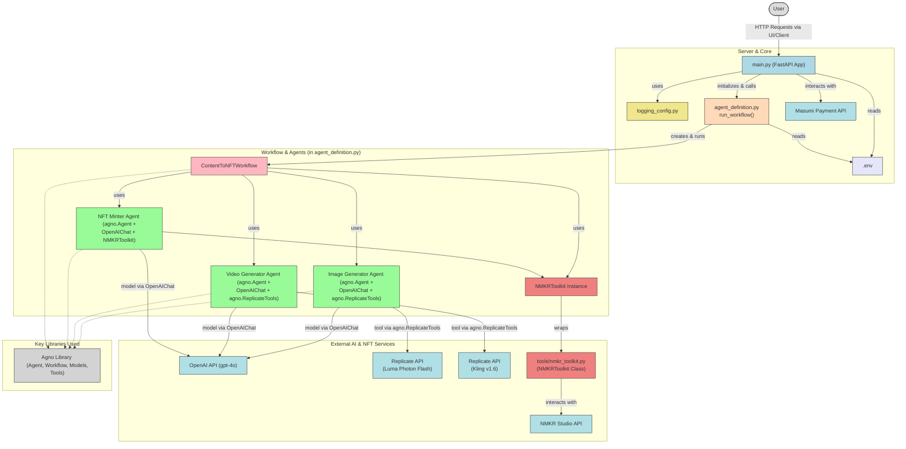

# Agno NFT Creator Agent

A service that generates AI-powered content (images/videos) and mints it as NFTs on the Cardano blockchain, integrated with the Masumi payment protocol.

## Overview

The Agno NFT Creator Agent is a full-featured NFT creation service that:

1. Generates high-quality AI images or videos based on text descriptions
2. Mints these creations as NFTs on the Cardano blockchain using NMKR Studio
3. Transfers the minted NFTs to the user's provided wallet address
4. Integrates with the Masumi payment protocol for secure blockchain-based transactions

## Features

- **AI Content Generation**: Create stunning images using Replicate's Luma API or videos with Kling API
- **Seamless NFT Minting**: Automated minting via NMKR Studio API
- **Cardano Integration**: All NFTs are minted on the Cardano blockchain (testnet/preprod)
- **Payment Processing**: Secure payments via Masumi payment protocol
- **RESTful API**: Standards-compliant API with full documentation

## Requirements

- Python 3.9+
- OpenAI API key
- NMKR Studio API key (preprod/testnet)
- Masumi payment service access

## Installation

1. Clone the repository:
   ```
   git clone https://github.com/yourusername/agno-nft-creator-agent.git
   cd agno-nft-creator-agent
   ```

2. Install dependencies:
   ```
   pip install -r requirements.txt
   ```

3. Set up environment variables in a `.env` file:
   ```
   OPENAI_API_KEY=your_openai_key
   NMKR_PREPROD_API_KEY=your_nmkr_key
   PAYMENT_SERVICE_URL=your_masumi_service_url
   PAYMENT_API_KEY=your_masumi_api_key
   NETWORK=Preprod
   AGENT_IDENTIFIER=your_agent_id
   PAYMENT_AMOUNT=10000000
   PAYMENT_UNIT=lovelace
   SELLER_VKEY=your_seller_vkey
   ```

## Usage

### Starting the Server

Run the server with:
```
python main.py api


The server will start on `http://0.0.0.0:8000`

### API Endpoints

#### 1. Start a Job

```http
POST /start_job
```

Request body:
```json
{
  "identifier_from_purchaser": "example_purchaser_123",
  "input_data": {
    "prompt": "A digital painting of a futuristic city with floating islands",
    "content_type": "image",
    "wallet_address": "addr_test1qz47ranxl4p5l97hwtd6793tavxqzzn6mtgmg6ztwf7356x6cluln4vc579dv335axeyk9a9fg9seql3h2d230vve5wscmmu9h",
    "display_name": "My Awesome NFT"
  }
}
```

#### 2. Check Job Status

```http
GET /status?job_id=your_job_id
```

#### 3. Check Server Availability

```http
GET /availability
```

#### 4. Get Input Schema

```http
GET /input_schema
```

#### 5. Health Check

```http
GET /health
```

## Workflow

1. User submits a request with a text description, content type, and wallet address
2. The system processes payment via Masumi payment protocol
3. Upon payment confirmation, an AI agent generates the requested content
4. The content is uploaded and minted as an NFT on the Cardano blockchain
5. The NFT is transferred to the user's provided wallet address
6. Status and transaction details are made available via the API

## System Architecture

The following diagram illustrates the high-level architecture and typical request flow of the Agno NFT Creator Agent:



**Diagram Explanation:**
- **User:** Represents the end-user interacting with the system, typically through a UI that calls the API.
- **main.py (FastAPI App):** The entry point of the application, handling HTTP requests, payment integration via Masumi, and initiating the NFT creation process.
- **agent_definition.py (run_workflow):** Contains the core logic for the NFT creation, orchestrating the different agents.
- **ContentToNFTWorkflow:** A workflow defined in `agent_definition.py` that sequences the steps of content generation and minting.
- **Agents (Image Generator, Video Generator, NFT Minter):** Specialized agents within the workflow. They use OpenAI models for understanding/prompting and specific tools (Replicate for content generation, NMKRToolkit for minting).
- **tools/nmkr_toolkit.py:** Provides the `NMKRToolkit` class, a dedicated interface for interacting with the NMKR Studio API.
- **External APIs:** Third-party services like OpenAI, Replicate (for image/video models like Luma and Kling), NMKR Studio, and Masumi Payment.
- **.env:** The file storing environment variables (API keys, configuration).
- **logging_config.py:** Manages application logging.
- **Agno Library:** The underlying library providing the framework for agents, workflows, and tool integrations.

## Content Types

The service currently supports two content types:

- **image**: Creates a high-quality image based on the description
- **video**: Creates a short video based on the description

## Development

### Project Structure

- `main.py`: FastAPI server and API endpoints
- `agent_definition.py`: Core logic for the AI workflow
- `tools/`: Custom tools for NFT operations

### Running Tests

To test the NFT creation workflow directly:

python agent_definition.py


## License

MIT License

Copyright (c) 2025 Agno Content to NFT Service

Permission is hereby granted, free of charge, to any person obtaining a copy
of this software and associated documentation files (the "Software"), to deal
in the Software without restriction, including without limitation the rights
to use, copy, modify, merge, publish, distribute, sublicense, and/or sell
copies of the Software, and to permit persons to whom the Software is
furnished to do so, subject to the following conditions:

The above copyright notice and this permission notice shall be included in all
copies or substantial portions of the Software.

THE SOFTWARE IS PROVIDED "AS IS", WITHOUT WARRANTY OF ANY KIND, EXPRESS OR
IMPLIED, INCLUDING BUT NOT LIMITED TO THE WARRANTIES OF MERCHANTABILITY,
FITNESS FOR A PARTICULAR PURPOSE AND NONINFRINGEMENT. IN NO EVENT SHALL THE
AUTHORS OR COPYRIGHT HOLDERS BE LIABLE FOR ANY CLAIM, DAMAGES OR OTHER
LIABILITY, WHETHER IN AN ACTION OF CONTRACT, TORT OR OTHERWISE, ARISING FROM,
OUT OF OR IN CONNECTION WITH THE SOFTWARE OR THE USE OR OTHER DEALINGS IN THE
SOFTWARE.

## Credits

- Built with [FastAPI](https://fastapi.tiangolo.com/)
- AI content generation via [Replicate](https://replicate.com/)
- NFT minting via [NMKR Studio](https://www.nmkr.io/)
- Payment processing via [Masumi Protocol](https://www.masumiprotocol.io/)